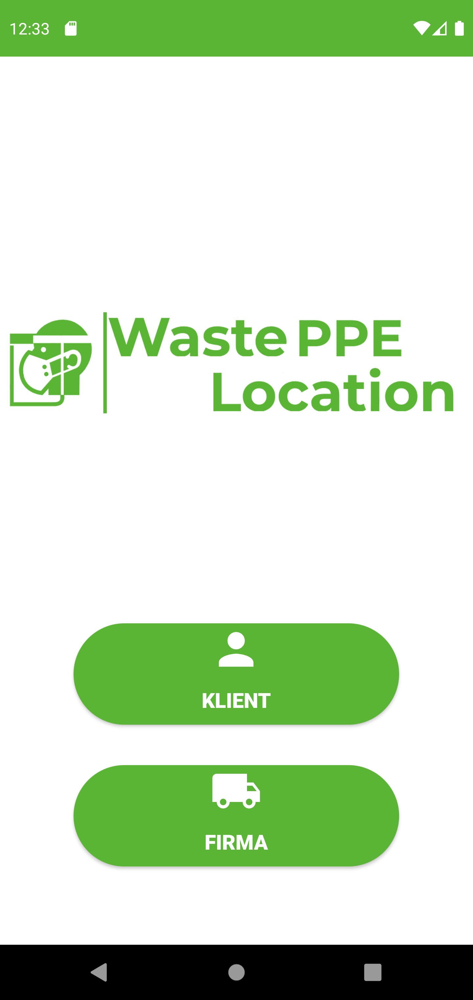
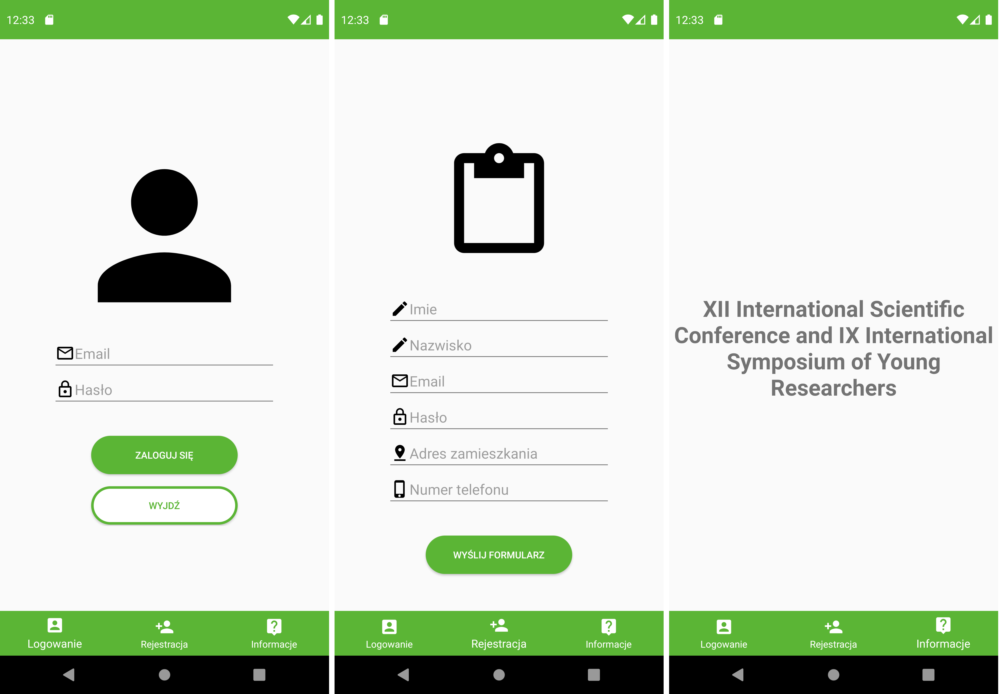
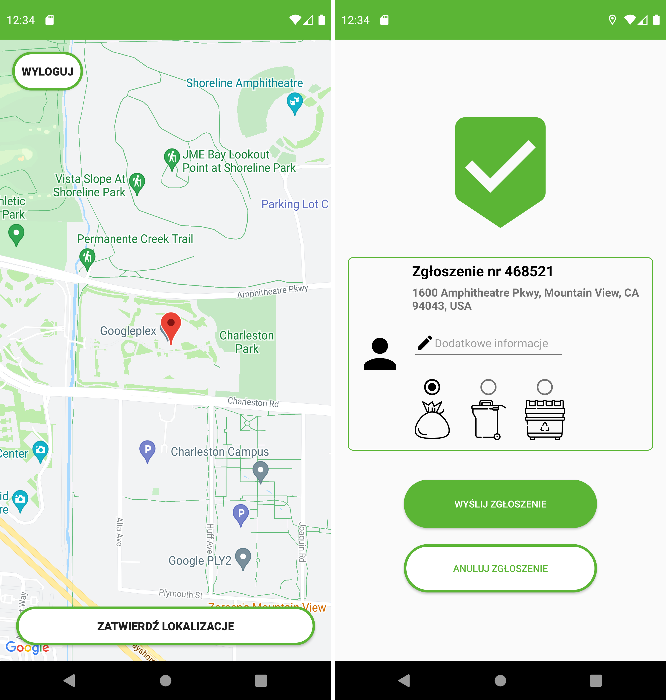
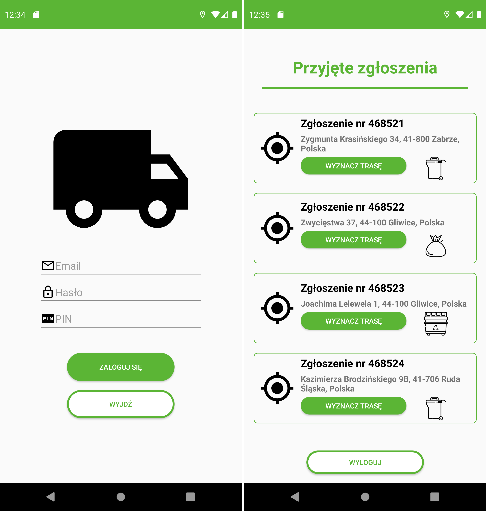

# WastePPELocation_prototype
WastePPELocation is a mobile application created for the conference: XII International Scientific Conference and IX International Symposium of Young Researchers. I named it as a prototype because not all of its functions have been implemented.

## Features
This study proposes  a novel  mobile app  to facilitate  the collection  of waste  PPE generated  in households, institutions, and companies. The main goal was to design a simple but functional mobile app  with  a possible  extension to  a  website based  system for  reporting  waste  personal  protective equipment for the collection. The functionality of the app includes the selection of the commonly used containers for waste collection like plastic bags – for households, bins for larger settlements, and small containers.  The  prototype  application  allows  for  easy  communication  by  residents  with  waste collection companies. Additional features include a possibility of registering all waste collection calls and  export these  data to  any  routing optimization  software.  The route  optimization  results in  the assignment of  a sufficient number of vehicles and  employees for the  waste collection plan. Future work can include an  extension of the  features of the mobile app  and design of the website based system to be able to send data via any browser to be applied on any stationary computer or mobile device.

## Interface
The application interface is divided into two parts, which are visible in the first window after its launch. On the login panel shown in figure, 
a user  can  make a  choice  depending  on  whether request  waste  PPE  collection  (“client”  - klient)  or display ongoing waste collection requests (“admin” - firma).

### Client-side in the application
The client panel is a part of the mobile application. After pressing this button, a user goes to the next activity, which has a navigation function consisting of three elements. The first is the login panel, where a user can enter login details and if they are correct, the user can proceed. However, if it is a new user, it is a possibility to register. In this activity, it is possible to enter a name, email, password, home address, and telephone number. The third item in this menu is useless. Currently this part is not linked to the API, so it just looks nice.

After a successful login attempt, the person using the application is transferred to location activity. The interface of this window consists of a geographic map stretched across the screen and two buttons, where the first one in the upper left corner is used to log out and the second one, located at the very base, is used to confirm the location shown . When the location service is enabled in the device, the application automatically determines our location with very high accuracy and sticks a pin-shaped icon to it. Maps SDKs have been used here.

The last step in the waste PPE collection request in the client's panel is the notification sending window. The interface of the app consists of a frame in which we have all the necessary information and two buttons for sending or canceling the notification for some reason. Important information is sent at the next step. A user indicates a waste pickup location and provides additional information that could be useful for the logistics employee of the waste collection company. A user must select the size or volume of the bag or container for storage waste PPE. For this purpose, it can be selected one of three icons, a plastic bag, a small container, and a medium-sized container.

### Admin-side in the application
The admin side of the mobile app is for logistics employees in waste collection companies. After selecting this mode a user can log in as administrator. All waste collection requests are displayed. The interface of this window consists mainly of tiles where the information about  the customer's request number, waste bag or  container location and, a button to calculate a route from our current location. This option can be helpful for a driver visiting scheduled locations. Also, no connection to the API, as in the customer panel.

